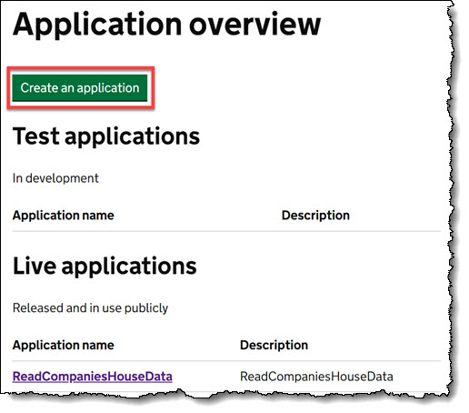
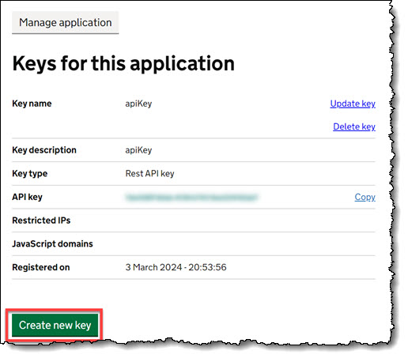

# Uses Companies House API to lookup companies in your locality and also work out the distance from you using the Postcodes API

I needed to get addresses and distances of companies local to my area for a small project.
There are two methods of getting the requisite data.
- Call getCompaniesInfo() If you want to use a specific list of companies to return the data on. This is pulled from the companiesData.go file
- Use a generic search to look for the type of companies you are interested in. In my example it was Architecture firms
---

You must [register](https://developer.company-information.service.gov.uk/signin) a user account with Companies House to explore and perform tests with the Companies House API.

At the time of upload there is a [rate limit](https://developer.company-information.service.gov.uk/developer-guidelines/) of 600 requests in aa 5 minute period.

## To create an API Key
1. Once registered you will need to [Create a New Application](https://developer.company-information.service.gov.uk/manage-applications/add) in the Companies house developer portal. Make sure you create a **Live** Application.

2. Go to [Manage Application](https://developer.company-information.service.gov.uk/manage-applications) and click on the Create new Key button.

3. Save the key along with lattittude and longditude coordinates to your .env file

4. Compile and run!